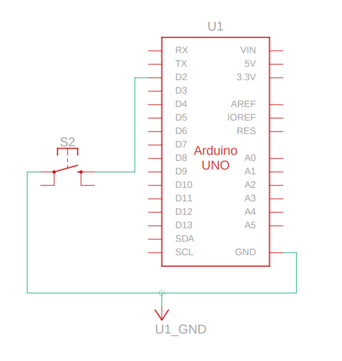

# Arduino Button → Node.js Automation

This project connects an **Arduino button** to a **Node.js server** so you can trigger desktop actions (like opening Brave in incognito mode) when you press the button.

## ⚡ Tech Stack

## 🚀 Features
- Read button press input from Arduino via **serial (USB)**.  
- Node.js listens to the serial port and reacts to input.  
- Runs system commands on button press (e.g., open Brave in incognito).  
- Easy to extend for any automation: launching apps, scripts, or websites.

---

## 🛠 Requirements
- **Arduino** (any board with USB, e.g., Uno, Nano, Mega).  
- **Node.js** (v18+ recommended).  
- **Brave browser** installed (or change the command to another app).  
- Linux system (example uses `/dev/ttyACM0`).  

---

## 🔌 Wiring
- Connect a **push button** to Arduino pin **2**.  
- Use the **internal pull-up resistor** (no external resistor needed).  
- Circuit:
  - One button leg → Pin 2  
  - Other leg → GND  

### 🖼 Schematic
Here’s the schematic for the button wiring:

</img>

